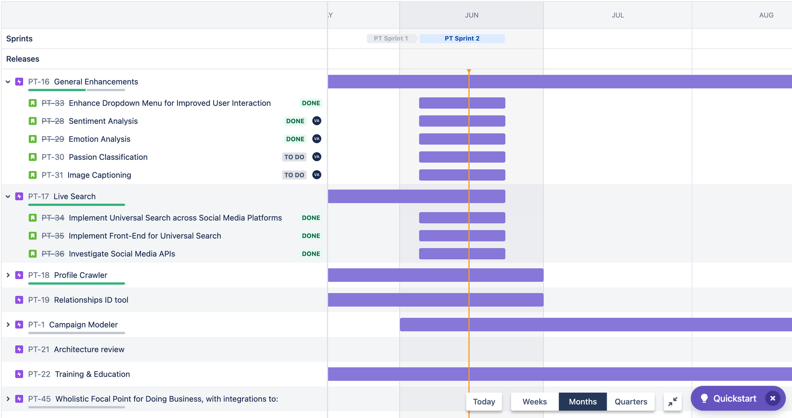
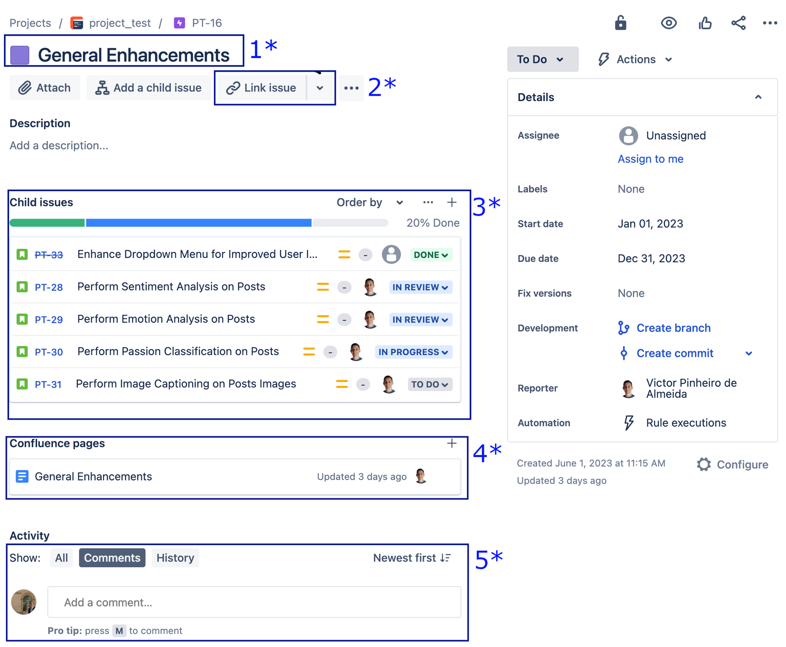
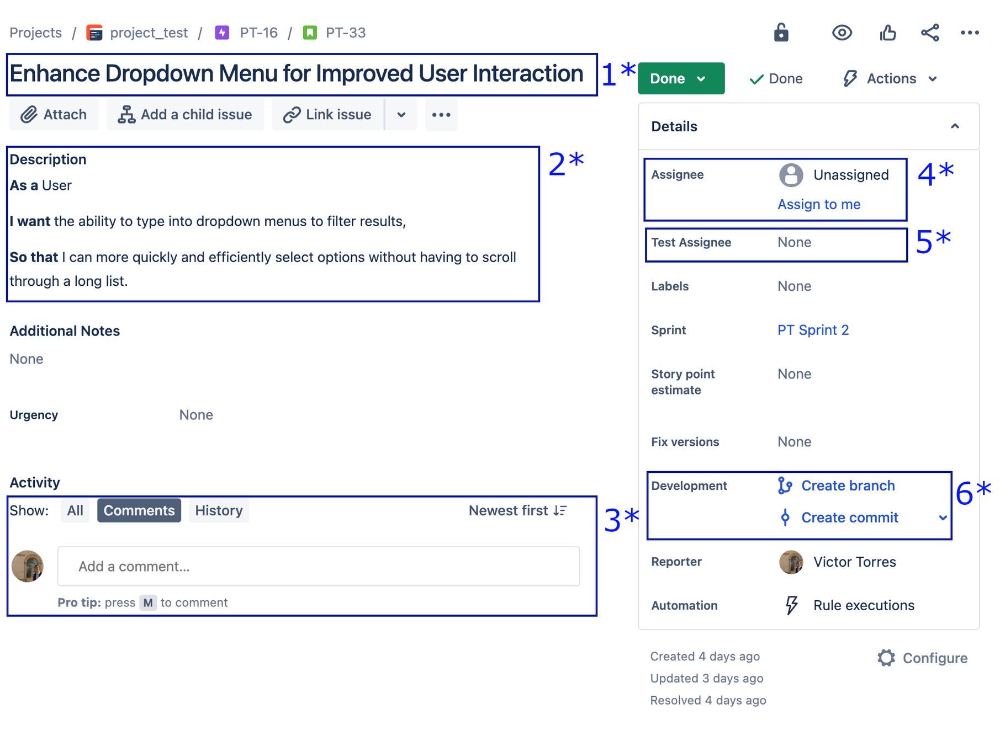
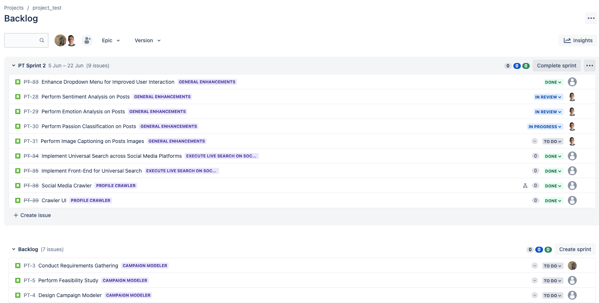
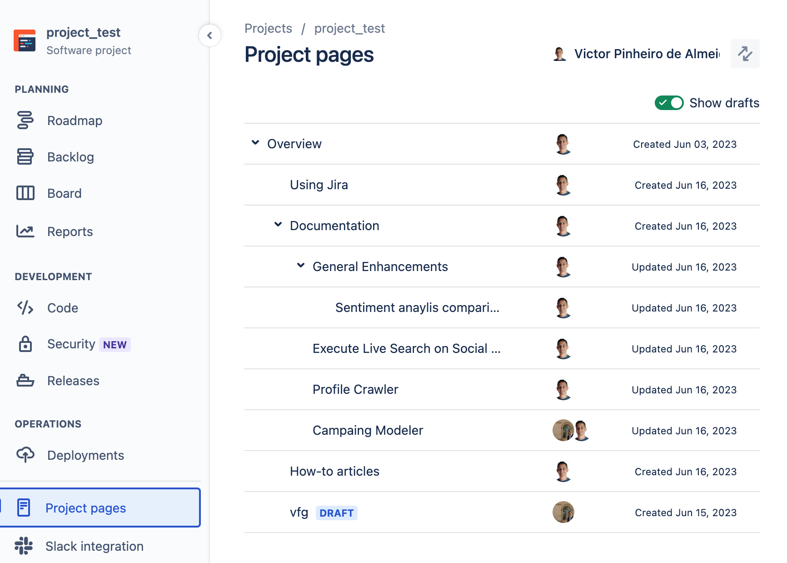

When I began at my current company, the sole developer which had been working on the company's platform for over 10 years, even though this developer had a great knowledge and experience, it was not natural to her to delegate tasks and was not also using any project management tool. I came up with the idea to introduce Jira to help us to have a central point where to see the tasks and enhacements we had to work on. After speaking with the developer and our director, they open me the space to present them Jira so that they could understand if would it be a good fit for the company. 

I have them created the document below as part of my presentation about Jira, highlighting the main features, and how it could help us to manage our projects.

After the presentation, we agreed on using Jira and we are making use of it since them.

 
 

# Using Jira
Jira is a project management tool used by agile software development teams. It allows for tracking bugs, user stories, tasks, and various project components in a centralized location. The primary goal is to facilitate better project management, collaboration, and communication within teams.

Here's a brief breakdown of how Jira can benefit the team:

1. **Issue and Project Tracking:** Jira allows team members to create, track, and manage the life cycle of tasks (issues) associated with software development. This includes bugs, feature requests, tasks, and user stories. It also provides a single source of truth about the status of the work.
2. **Agile Methodology Support:** Jira supports Agile methodologies like Scrum and Kanban. Teams can create Scrum boards for sprints, or Kanban boards for continuous flow of work. It helps teams to prioritize tasks, manage backlogs, plan sprints and releases.
3. **Customizable Workflow:** Jira's workflows are highly configurable, allowing teams to tailor the software to fit their specific processes. Each step in a task's lifecycle can be clearly defined, and triggers can be set up to automate actions as tasks move through stages.
4. **Reporting and Analytics:** Jira has built-in reporting tools that provide visual data on metrics like team velocity, burndown/burnup charts, cumulative flow diagrams, and others. These can be very useful for tracking project progress and team performance, and for planning future work.
5. **Integration Capabilities:** Jira integrates well with a number of other tools that teams may be using, such as Confluence (for documentation), Bitbucket, Slack, and many more.
6. **Collaboration:**** Jira allows for easy communication and collaboration. Team members can comment on tasks, tag each other, attach files, and more. It can also send notifications to keep everyone up to date on task progress.

 

## Main Jira concepts

1. **Epic:** An Epic is a large body of work that can be broken down into several smaller tasks. It's a big, broad objective that requires substantial effort to complete. For instance, "Redesign the website" could be an Epic.
2. **Story (User Story):** A Story, or User Story, is a description of a feature or requirement from the perspective of an end-user. It's smaller than an Epic but usually involves several tasks to complete. For example, "As a user, I want to be able to reset my password so that I can access my account if I forget it."
3. **Bug:** A Bug is a problem or error in the software that needs to be fixed. It's something that's not working as intended. For example, "The 'forgot password' link redirects to the homepage instead of the password reset page."
4. **Task:** A Task is a piece of work that needs to be done. It's usually a smaller piece of work, a part of a User Story or an Epic. For example, "Code the UI for the password reset page."

 

### Roadmap

We have to build a roadmap that outlines our Epics and Stories. By establishing a timeline for completion, we enable Jira to monitor and compare the actual progression of our work against our projected timeline.

### Epic
<table>
<tr>
<td style="width:50%">

</td>
<td tyle="width:50%">

<h4 style="text-align: center"> Epic </h4>

1. Epic Title
2. We can link a confluence page to the Epic
3. All stories created for that epic
4. Link for confluence page, where we can have more information about what is expected for that epic.
5. We could make comments about the Epic or the stories inside it
</td>
</tr>
</table>

### Story

<table>
<tr>
<td style="width:50%">
<h4 style="text-align: center"> Story </h4>

1. Story Title
2. Description always following the format: As a…, I want to… So that…
3. Exchange comments on this particular story
4. Assingne someone for the task
5. Assigne someone to test the code, for example once I (Victor) finish the code (Kate) will review it.
6. We can create branches on Bitbucket straight from Jira.

</td>
<td tyle="width:50%">

</td>
</tr>
</table>

 

### Backlog

All Jira stories are automatically populated into the backlog. At the end of each sprint, we then move the pertinent stories into the forthcoming sprint.

### Board

Board is where we can monitor the progression of our sprint tasks in real-time.

### Projects Page

We can find/create/wirte more detailed requeriments for each Epic, add information on why choosing one soluction over another for each task, and to create documantation.

